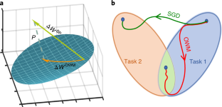
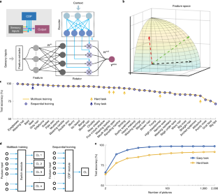

# 2024.3.25

> Reported by
> 
>  群落及多样性小组 23硕-张燕
> 
>  数据分析及算法开发小组 22硕-门雅惠、23硕-王翰羽 
---
## 王翰羽
- 文献：https://www.nature.com/articles/s42256-019-0080-x
- 正交权重修改(orthogonal weights modification，OWM)算法
- 
- 情境依赖处理(context-dependent processing，CDP)模块
- 
---
## 门雅惠
- 制作网页
- 昆虫植物互作+物种分类
---
## 张燕
- 草地貪夜蛾
- https://zh.wikipedia.org/zh-hans/%E8%8D%89%E5%9C%B0%E8%B2%AA%E5%A4%9C%E8%9B%BE
